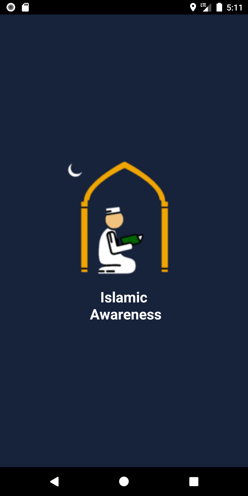
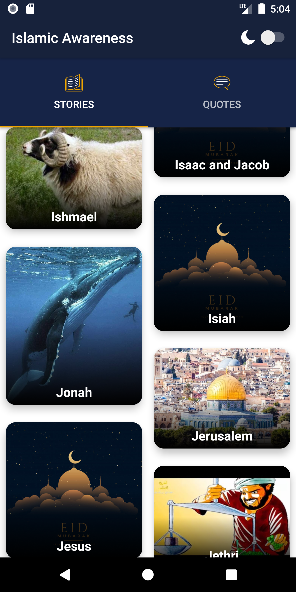
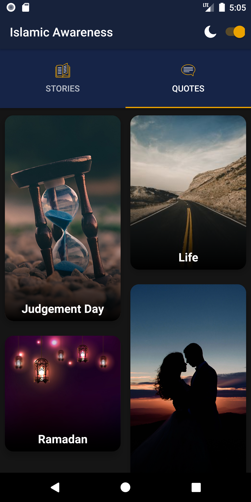
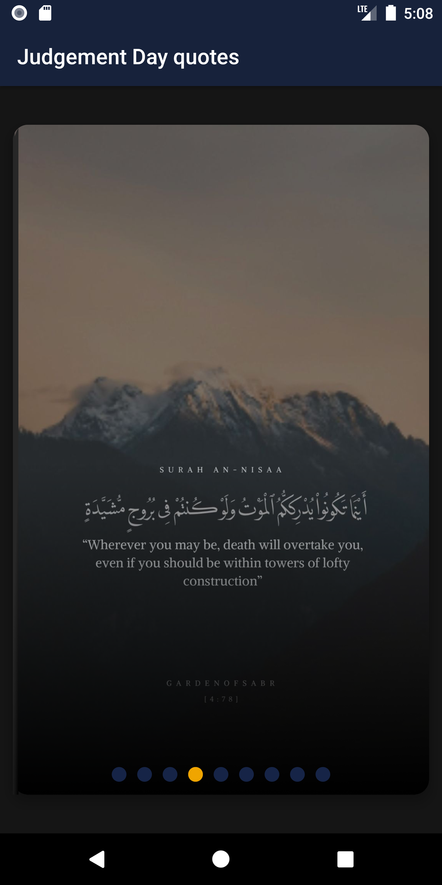
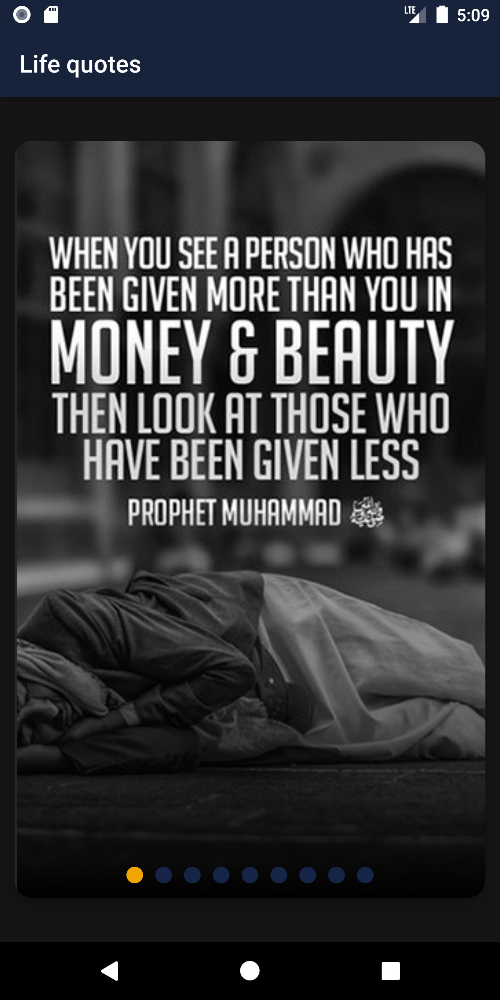
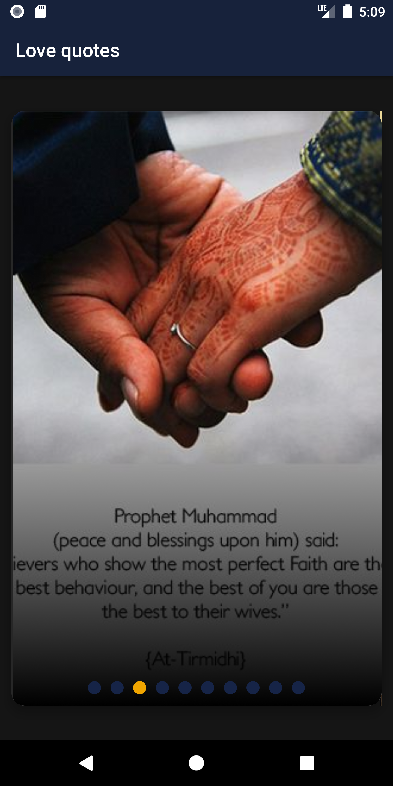
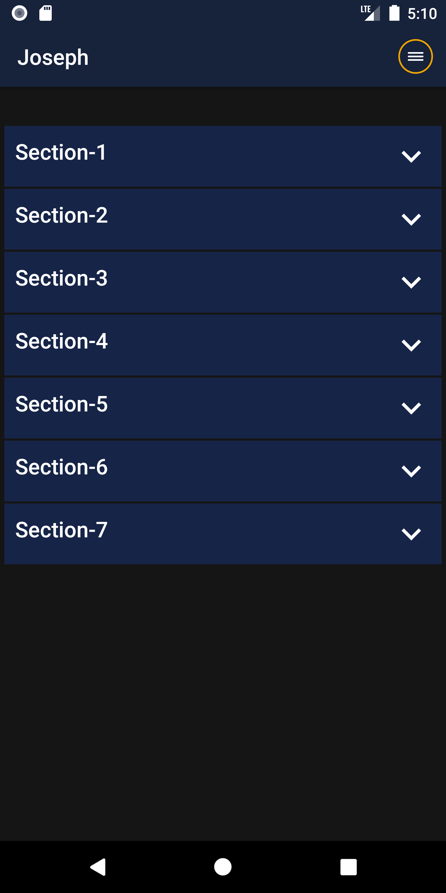
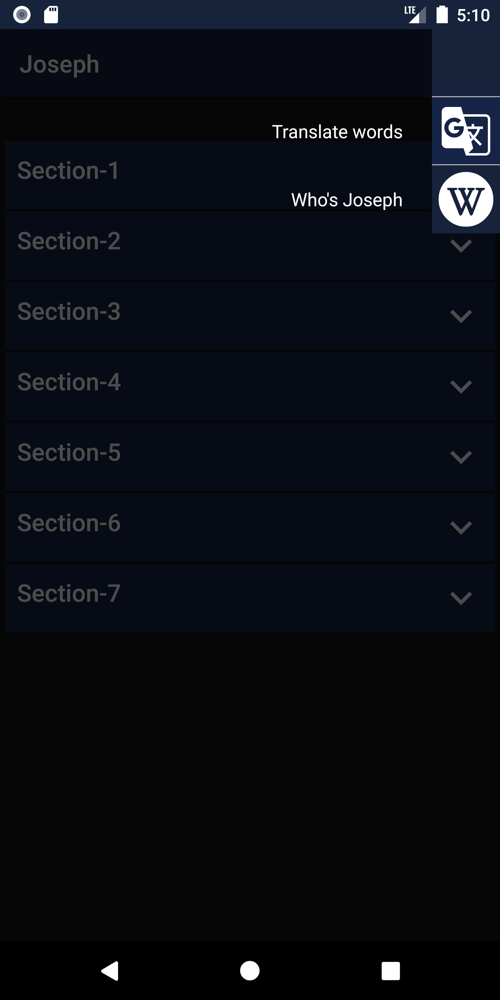

# Islamic Awareness

Android App for reading prophets stories and islamic quotes which needed in daily life

### Built With

* [Kotlin] - The programming language used
* [MVVM] - The design pattern used
* [Firebase] - The BaaS used
* Other Librraires used for design

### Authors

* [Muhammad Ramadan](https://www.linkedin.com/in/m7mdramadandx/)

### Sample from app

    

    

    

