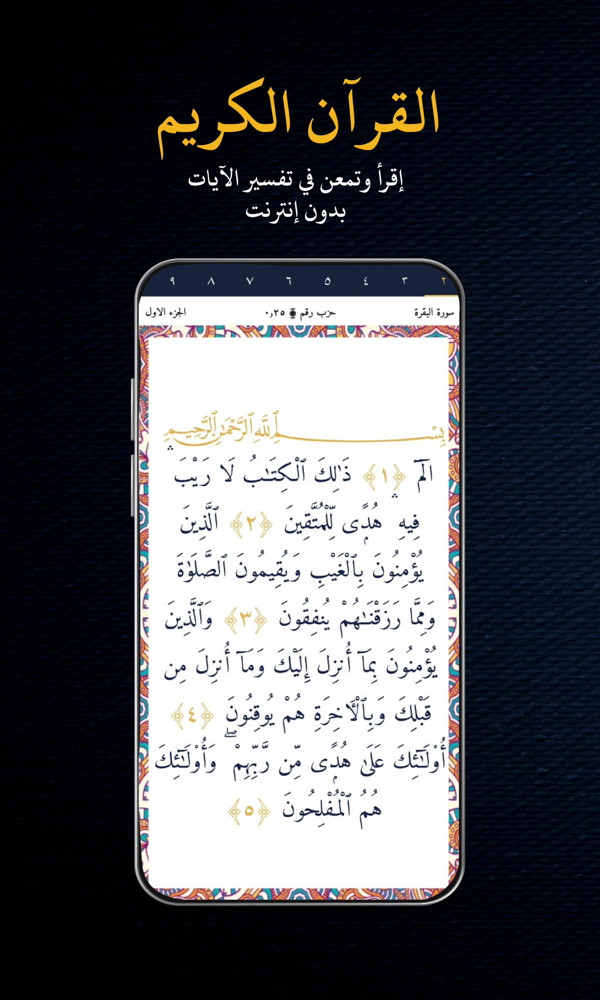

# islami-
islami App eases and notifies your Islamic duties.

# Google Play -

islami App eases and notifies your Islamic duties. We provide an accurate prayer time & azan application, also features the Holy Quran as well as Qibla locator, an Islamic Hijri calendar, hadiths, Huge library of remembrance, important topics and videos, etc...

MAIN FEATURES:

• Accurate prayer times based on your current location
• Azan: visual and audio notifications for the calls for prayers
• Azkar: huge collection of azkar categorized in an awsome style (Morning, Evening, Prayer, Azan, etc...)
• The Holy Quran (offline)
• Stories: all the mentioned storied in the Holy Quran (prophets stories)
• Topics: collection of an important topics help muslims in daily life suppoted with videos
• Date Conversion: Completed Muslim Hijri calendar and able to change from hijri to gregorian and vise versa
• Beautiful Islamic verses and hadiths in images from could be shared and downloaded (Forgiveness, Inspirational, Judgement Day, Ramadan, etc...)
• Verse of Day: Daily Verses
• Hadith of Day: Daily hadiths
• Animated Qibla compass shows you the direction to Mecca
• 99 names of Allah
• Family tree: three family trees (Prophet Muhammad pbuh family tree, prophets family tree, great family tree)
• App fully translated to both English & العربية
• App could switched to dark theme

ANDROID PERMISSIONS

Location (GPS and network-based): your location is required to calculate accurate prayer times and the Qibla.

Storage / Photos / Media / Files: this permission is required to download images

تطبيق إسلامي يسهل و ينبهك بعباداتك اليومية . نحن نقدم تطبيقًا دقيقًا لمواقيت الصلاة والأذان ، كما يتميز أيضًا بالقرآن الكريم بالإضافة إلى محدد موقع القبلة والتقويم الهجري الإسلامي والأحاديث ومكتبة ضخمة للاذكار وموضوعات مقالية و فيديوهات ، إلخ ...

الخصائص الرئيسية:

• مواقيت صلاة دقيقة بناءً على موقعك الحالي
• الأذان: تنبيهات صوتية ومرئية لدعوات الصلاة
• الأذكار: مجموعة ضخمة من الأذكار المصنفة بأسلوب رائع (صباح ، مساء ، صلاة ، أذان ، إلخ ...)
• القرآن الكريم (غير متصل)
• القصص: كل ما ورد في القرآن الكريم (قصص الأنبياء).
• المواضيع: مجموعة من المواضيع الهامة تساعد المسلمين في الحياة اليومية مدعومة بالفيديوهات
• تحويل التاريخ: التقويم الهجري الإسلامي المكتمل وقادر على التغيير من الهجري إلى الميلادي والعكس بالعكس
• آيات وأحاديث إسلامية جميلة في صور يمكن مشاركتها وتحميلها (مغفرة ، إلهام ، يوم القيامة ، رمضان ، إلخ ...)
• آية اليوم: آيات يومية
• أحاديث اليوم: الأحاديث اليومية
• بوصلة القبلة المتحركة توضح لك اتجاه مكة
• 99 اسما من أسماء الله الحسنى
• شجرة العائلة: ثلاث شجرات (شجرة عائلة النبي محمد صلى الله عليه وسلم ، شجرة عائلة الأنبياء ، شجرة عائلة كبيرة).
• التطبيق مترجم بالكامل إلى اللغتين الإنجليزية والعربية
• يمكن أن يتحول التطبيق إلى المظهر الداكن

### Authors
* [Muhammad Ramadan](https://www.linkedin.com/in/m7mdramadandx/)

### Sample from app

    

    
